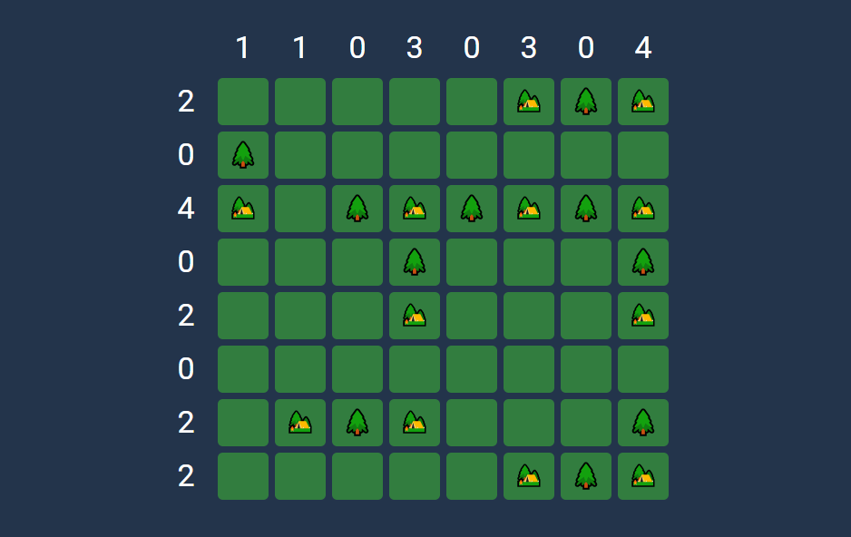

# **Trees and tents**
Logic games have forever been a passion of mine. This is just a small side project I made trying to replicate an old favorite of mine and improve my HTML/CSS/JS skills, as a recent Dev Student.

You can give it a try at https://smartiepinheiro.github.io/trees_and_tents/

### Game rules

For the unfamiliar the goal of **Trees and tens** is to **find a spot for 12 tents in the campsite**. There are, however, some requirements you must follow:

**1.** A tree must be immediately next to each tent (diagonal is not allowed).  
**2.** In total there are as many tents as trees. So every tent has its own tree.  
**3.** The numbers outside the grid indicate how many tents there are in the relevant row or column.  
**4.** Tents never touch each other: neither horizontally nor vertically nor diagonally.  
**5.** A tent can make contact with multiple trees, but is only connected to one.  

A correctly solved board could look something like this: 

### Features
✔️ Rules button;  
✔️ Random generated solution every time;  
✔️ Win after the players' table if fully and correctly completed (allowing multiple possible solutions);  
✔️ 'Games won' stores the numbers of wins in the localstorage and displays it to the user;    
✔️ 'Current Time' timer, that starts with the first table click;  
✔️ 'Current Time' resets on every game;  
✔️ 'Highscore' time stored in the localstorage, that updates and displays the user's fastest win time.  
✔️ Play Again button that reloads the game;  
✔️ Responsive to window resize: allows horizontal/vertical play.  

### Thank you so much for the time 🙋